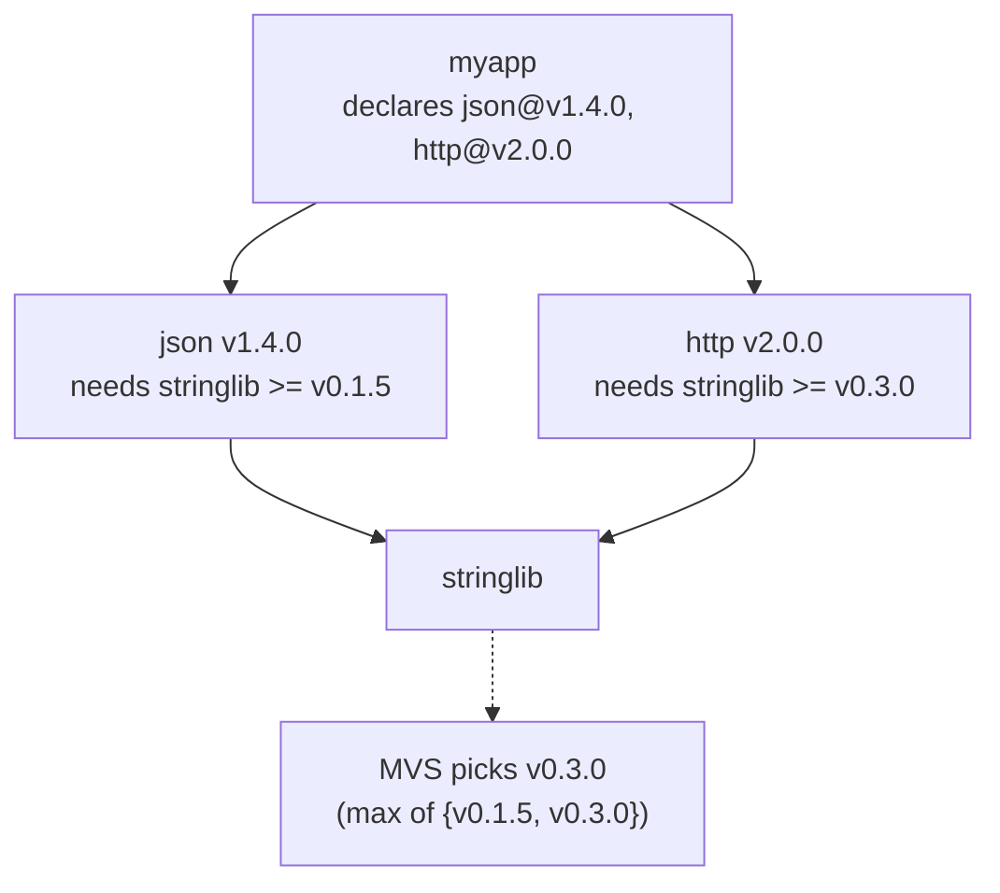
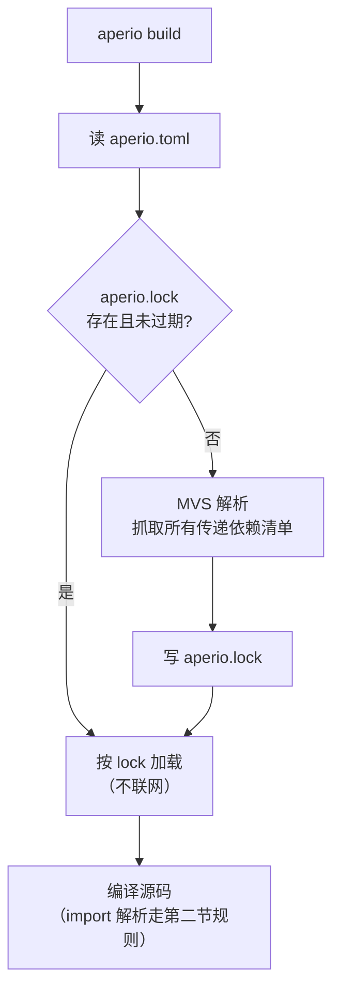

# 04. 解析与 import

这一章讲两件关联但独立的事：

1. **依赖解析**：`aperio.toml` + 所有传递依赖的清单 → 确定一组具体版本
2. **import 路径解析**：源码里的 `import "..."` 如何找到对应文件

## 依赖解析：MVS 算法

Aperio 用 **MVS**（Minimum Version Selection）解析依赖。算法三步：

1. 收集所有依赖链上对同一包 `P` 的"下界声明"
2. 对每个 `P`，取所有下界的**最大值**作为选定版本
3. 拉取该版本的清单，检查它的依赖，递归上面两步直到不动点

### 图示

假设项目 `myapp` 声明：

```toml
[deps]
json = "github.com/aperio-lang/json@v1.4.0"
http = "github.com/aperio-lang/http@v2.0.0"
```

而 `json@v1.4.0` 的清单里有：

```toml
[deps]
stringlib = "github.com/aperio-lang/stringlib@v0.1.5"
```

`http@v2.0.0` 的清单里有：

```toml
[deps]
stringlib = "github.com/aperio-lang/stringlib@v0.3.0"
```

解析过程：



最终选定版本：

- `json` → `v1.4.0`
- `http` → `v2.0.0`
- `stringlib` → `v0.3.0`

### MVS 的关键性质

- **确定性**：给定同一组 `aperio.toml`，解出来的版本永远一样
- **局部性**：想升级某个包只需改它自己的下界；不影响其他依赖
- **低意外性**：没有 SAT 求解器的回溯和冷门分支——你看到的就是你得到的
- **单版本保证**：同一个包在整个依赖图里**只有一个版本**被选出（不像 npm 那样可以并存多份）

### 冲突与处理

MVS 本身几乎不产生冲突——取最大值永远有解。但下列情况会报错：

- **major 版本不兼容**：两条链要求 `stringlib@v1.*` 和 `stringlib@v2.*` → `E9201 incompatible major versions`（解决：在根 `aperio.toml` 里显式写 `stringlib = "github.com/.../stringlib@v2.0.0"`，强制所有人升到 v2）
- **commit sha 与 tag 不一致**：一条链钉到 `stringlib@a1b2c3d4`，另一条要求 `stringlib@v0.3.0`——如果两者不是同一 commit → `E9202 conflicting refs for same package`
- **循环依赖**：A 依赖 B，B 依赖 A → `E9203 dependency cycle`（允许跨边界的类型/常量循环，但包级循环禁止）

## import 路径解析

源码里每一条 `import "<path>" as <alias>` 在语义分析时会被转成具体的文件路径。解析按**前缀**分派。

### 分派表

| 路径前缀 | 解析目标 | 示例 |
|---------|----------|------|
| `std/*`       | 标准库（随编译器分发，见 [09. 标准库](./09_stdlib.md)） | `import "std/io" as io` |
| `./*` / `../*`| 相对当前文件所在目录 | `import "./helpers" as h` |
| `/*`          | 相对**项目根**（`aperio.toml` 所在目录） | `import "/src/shared" as sh` |
| `<pkgname>/*` | 查 `aperio.toml` 的 `[deps]`，短名匹配 | `import "json/ast" as ja` |

### 禁止的写法

**不允许**在 `import` 里写出完整 VCS 路径或版本号：

```rust
// 全部是编译错
import "github.com/aperio-lang/json@v1.4.0" as j  // E5004 version in import path
import "github.com/aperio-lang/json" as j         // E5005 raw VCS path in import
import "json@v1.4.0" as j                          // E5004 version in import path
```

理由：

- 版本集中在 `aperio.toml`，改版本只改一处
- 避免同一个项目里同一个包出现两个版本的入口
- `git grep 'github.com'` 不会在代码里到处都是噪音

### 第三方包的子路径

包名后面可以跟子路径，对应被引包的**包内**目录：

```toml
[deps]
json = "github.com/aperio-lang/json@v1.4.0"
```

假设 `json` 包的布局：

```
json/
├── aperio.toml
└── src/
    ├── parse.ap       # 暴露 parse / stringify
    ├── ast.ap         # 暴露 Node、Kind 等
    └── internal.ap    # 包内部用，没有 pub
```

消费方：

```rust
import "json/parse" as jp        // 解析到 json 包里 src/parse.ap
import "json/ast" as jast        // 解析到 json 包里 src/ast.ap
import "json" as j               // 解析到 json 包的入口文件 src/main.ap 或 main.ap
```

**入口文件优先级**：包根目录下的 `main.ap` > `src/main.ap` > `<pkgname>.ap`。

### 未登记的短名

`import "foo/bar"` 如果 `foo` 不在 `aperio.toml` 的 `[deps]` 里：

```
error[E5003]: unknown package 'foo'
   ╭─▶ src/main.ap:3:8
   │
 3 │ import "foo/bar" as fb
   │        ^^^^^^^^^
   │
   = note: no entry for 'foo' in aperio.toml [deps]
   = help: run `aperio add foo@<version>` to add it
```

### 和 stdlib 的边界

`std/*` 永远优先——哪怕你在 `[deps]` 里有一个叫 `std` 的依赖也拿它没办法。`std` 是保留名，`aperio.toml` 里用它会触发 `E9106 reserved package name`。

## `aperio.lock` 的角色

解析完成后会写入 `aperio.lock`，固化每个包的 `source + version + commit + checksum`。`aperio build --locked` 严格按 lock 跑，不做任何网络或再解析——这是 CI 的默认模式。

详见 [05. aperio.lock](./05_lockfile.md)。

## 解析流程总图



## 本章与其他章节的映射

- 清单格式 → [02. aperio.toml](./02_manifest.md)
- 版本表达式语法 → [03. 版本表达式](./03_versions.md)
- lock 和冲突处理细节 → [05. aperio.lock](./05_lockfile.md)
- 缓存目录布局 → [06. 缓存与 vendoring](./06_cache.md)
