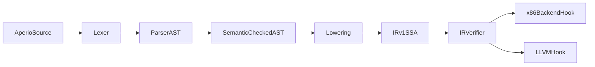

# Aperio 开发 TODO（当前主线：x86_windows 可执行优先）

状态约定：`[ ]` 未开始，`[~]` 进行中，`[x]` 完成。  
当前策略：先打通 `Aperio -> x86_64 asm(.s, Intel on GAS) -> obj -> exe`，LLVM IR 延后。  
loose 层继续暂缓。

## 重要等级总览（按当前目标）

- [~] `P0`（最高）：完成 AST 全覆盖（先把语言入口打穿）
- [~] `P1`（主目标）：生成 Windows 可执行文件（`.s -> .obj -> .exe`）
- [ ] `P2`（后续增强）：Desugar、工程化完善、性能与体验提升
- [ ] `P3`（远期目标）：LLVM IR 输出/互操作

---

## 0. 基础治理与对齐

- [ ] 建立统一状态面板（本文件 + issue 编号 + 负责人）
- [ ] 固化“文档是规范源”流程：语法变更必须先改 `docs/`
- [ ] CI 最小闭环：`build/test/lint`
- [ ] nightly 回归：解析器覆盖 `docs/` 示例
- [ ] 在 `ARCHITECTURE.md` 固化当前目标：`windows x64 first, llvm later`

---

## 1. `P0` Parser/AST 完整性（先把语言入口打牢）

## 1.1 Lexer

- [ ] 关键字与保留字全集（含 `alias`、属性、宏标记）
- [ ] 字面量全集（整型/浮点后缀、字符串、c 字符串）
- [ ] 运算符与分隔符全集（`::`、`->`、`@label`、`...`）
- [ ] 注释与错误恢复（非法字符、非法 token 连续恢复）
- [ ] token 位置和错误编号稳定化（`E1xxx`）

## 1.2 Parser

- [~] 顶层声明覆盖：`fn/extern fn/const/val/var/struct/type/import/macro`
- [~] 函数签名覆盖：参数、返回、`uses`、属性、别名绑定
- [~] 语句覆盖：赋值、多返回赋值、标签、`goto`、条件跳转
- [x] P0 扩展：调用规则 A（纯寄存器位置参数）、参数化 label/goto、`save`、结构化 `if`
- [~] 表达式覆盖：调用、`as`、地址、内存访问、运算符优先级
- [~] FFI/变参语法（`...`）解析
- [ ] native-strict x86 专属语法（`lea[...]`、限制式写法）解析
- [~] 消灭通用 `E2999`，改为精确语法错误

## 1.3 AST 契约

- [~] AST 节点字段对齐文档章节
- [ ] AST schema 版本化（避免工具链被破坏）
- [~] AST visitor 覆盖所有节点分支
- [ ] AST 打印器稳定（snapshot 友好）

## 1.4 验收（目标一）

- [~] `docs/std-strict` 示例可 parse（已接入 05/11/12 章节代码块采样回归，后续扩展到全章节）
- [ ] `docs/native-strict/x86` 示例全部可 parse
- [ ] 非法输入下 parser 可恢复并继续解析到文件末尾

---

## 2. `P1-基础` 语义与 SSA-IR 骨架（为 Windows 可执行链路做前置）

> 与 `c:\\Users\\Anri\\.cursor\\plans\\aperio-ssa-v1-plan_4c4b3237.plan.md` 对齐，作为当前主干架构。

## 2.1 语义分析

- [ ] 符号表与作用域（模块/函数/局部）
- [ ] 类型系统规则（指针、函数指针、转换）
- [ ] alias 语义（文件/签名/函数体）与冲突检查
- [ ] Dreg 类型流与合并点检查
- [ ] 模式守卫（`.ap/.x86.ap/.apo`）

## 2.2 IR v1（SSA-first）

- [ ] 定义 `module/function/block/value/instruction` 核心模型
- [ ] 终结指令强约束（每个 block 必须以 terminator 结束）
- [ ] 采用“块参数”表达 phi（前端不暴露显式 phi）
- [ ] AST -> IR 最小 lowering（函数、跳转、调用、返回）
- [ ] IR verifier：连通性、SSA 唯一赋值、类型一致性

## 2.3 验收（目标二前置）

- [ ] 至少 3 个控制流样例可 lowering 到 IR 并通过 verifier
- [ ] parser/semantic/ir 的 diagnostics 输出风格一致

## 2.4 SSA v1 分阶段执行（从 plan 整理迁移）

### Phase 1: Parser 覆盖核心文档语法

- [ ] 在 `packages/core/src/parser/parser.ts` 保持主循环稳定并扩展 rule 分发
- [ ] 在 `packages/core/src/parser/rules/function.ts`、`rules/expr.ts` 覆盖 `uses`、命名参数调用、多返回赋值、alias 声明入口
- [ ] 在 `packages/core/src/parser/state.ts` 增加细粒度错误构造，逐步替换通用 `E2999`

### Phase 2: AST/语义契约对齐（为 SSA 铺路）

- [ ] 在 `packages/core/src/ast` 补齐控制流合流所需节点（块、跳转参数、返回值组）
- [ ] 在 `packages/core/src/semantic/index.ts` 固化 pass 顺序：`aliases -> types -> dreg`
- [ ] 为 alias 与寄存器类型覆盖增加一致性检查，减少延迟错误

### Phase 3: IR v1（SSA-first）骨架

- [ ] 在 `packages/core/src/ir` 落地 `module/function/block/value/instruction` 五类模型
- [ ] 强约束：每个 block 必须以 terminator 结束
- [ ] phi 采用“块参数”建模（IR 内等价）
- [ ] 在 `packages/core/src/ir/index.ts` 导出稳定 API（供 lowering/verifier/backend 共享）

### Phase 4: Lowering + IR 验证器

- [ ] 新增 AST -> IR lowering（建议目录：`packages/core/src/lowering`）
- [ ] 最小支持：函数、基础算术、条件跳转、调用、返回
- [ ] 新增 IR verifier：连通性、terminator、SSA 唯一赋值、类型一致性
- [ ] parser/semantic/ir 诊断统一接入 diagnostics 输出链路

### Phase 5: 后端互操作预留（不做完整实现）

- [ ] 在 `packages/core/src/codegen/x86/regalloc.ts` 对齐 IR Value/Block 结构输入
- [ ] 在 `ARCHITECTURE.md` 固化 “SSA -> 物理寄存器” 边界策略（de-ssa 或分配期并入 copy coalescing）

### 数据流（实现参考）

### SSA v1 验收补充

- [ ] `docs` 关键章节示例可 parse 并产出 AST
- [ ] `regalloc` 可消费 IR 元信息（允许先返回 stub 结果）
- [ ] 无新增 parser 死循环，错误恢复可持续到文件末尾

---

## 3. `P1-主目标` x86_windows 后端主线（项目当前核心）

## 3.1 ABI Profile（Windows x64）

- [ ] 参数寄存器：`rcx, rdx, r8, r9`（整数/指针）
- [ ] 返回寄存器：`rax`（浮点走 `xmm0` 规则）
- [ ] caller/callee-saved 集合定义（含 XMM 策略）
- [ ] `shadow space`（32 bytes）规则落地
- [ ] 栈 16-byte 对齐规则落地

## 3.2 指令选择与汇编输出

- [ ] 指令选择：两操作数约束、`lea`、`mul/div` 固定约束
- [~] 汇编输出格式锁定：`.s` + `.intel_syntax noprefix`
- [ ] 文本段/数据段/符号可见性规则
- [ ] 函数序言/尾声模板（含保存恢复与栈帧）

## 3.3 产物链路（可执行）

- [x] `--emit asm` 输出 `.s`
- [x] `--emit obj` 通过工具链产出 `.obj`
- [x] `--emit exe` 链接生成 `.exe`
- [~] 首选 `clang` 驱动链路（后续再补其他工具链；已支持 MSVC `ml64+link` 自动回退）
- [~] `std/os/win` 最小链路（`os::exit` + `os::write_stdout`）打通到汇编发射

## 3.4 验收（当前里程碑）

- [x] `hello.ap -> hello.s -> hello.obj -> hello.exe` 全链路通过
- [ ] 至少 3 个样例可执行（调用、分支、内存访问）
- [ ] native-strict x86 样例可通过完整链路

---

## 4. `P1-主目标` 寄存器分配（线性扫描先行，图染色后续）

> 目标：先稳定可用，再升级最优；但架构一开始就为图染色预留接口。

## 4.1 线性扫描 v1（必须）

- [ ] 设计 live interval 构建器（按 SSA value）
- [ ] 物理寄存器集合按 reg class 建模（GPR/XMM 分离）
- [ ] call-site 约束接入（caller-saved 污染）
- [ ] spill/reload 插入与 spill slot 管理
- [ ] move resolver（处理并行拷贝/块参数入口）
- [ ] 与 `regalloc.ts` 对齐稳定输入输出契约

## 4.2 为图染色预留（现在就做架构，不急实现）

- [ ] 抽象 `RegAllocStrategy` 接口（`linear-scan`/`graph-coloring`）
- [ ] 抽象 `InterferenceProvider` 与 `CoalescingHintProvider`
- [ ] 保留 pre-coloring 入口（ABI 固定寄存器约束）
- [ ] 保留 copy coalescing 结果回写接口
- [ ] 保留 spill cost 模型扩展点（冷热路径权重）

## 4.3 验收（寄存器分配阶段）

- [ ] 在线性扫描下产物可执行且结果正确
- [ ] spill 后生成代码仍满足 ABI 与栈对齐规则
- [ ] 切换策略接口不需要改 instruction selector

---

## 5. `P2` Desugar 层（并行轻量推进）

- [ ] 定义核心语法与语法糖边界
- [ ] 增加 Desugar pass（AST in -> AST out）
- [ ] alias/命名参数/多返回赋值先做规范化
- [ ] 保持源码映射，报错仍指向原始源码

---

## 6. `P3` LLVM IR（后置，不阻塞主线）

- [ ] `Aperio -> LLVM IR` 仅做规划文档，不进主里程碑
- [ ] 类型映射和调用约定映射仅保留设计草案
- [ ] `E8xxx` 诊断号段预留，不强行落地

---

## 7. 与现有 SSA 计划的映射清单（必须同步）

- [ ] `parser-core-coverage`：并入本文件第 1 节
- [ ] `ast-semantic-contract`：并入本文件第 2.1/2.2 节
- [ ] `ir-v1-model`：并入本文件第 2.2 节
- [ ] `lowering-minimal`：并入本文件第 2.2 节
- [ ] `ir-verifier`：并入本文件第 2.2/2.3 节
- [ ] `backend-interop-hooks`：并入本文件第 3/4 节

---

## 8. 推荐执行顺序（按你当前目标重排）

1. 先完成第 1 节（`P0`: Parser/AST 全覆盖）  
2. 再完成第 2 节（`P1-基础`: 语义 + SSA IR + verifier）  
3. 紧接第 3 节（`P1-主目标`: x86_windows 汇编与可执行链路）  
4. 然后第 4 节（`P1-主目标`: 线性扫描寄存器分配，保留图染色接口）  
5. `P2`：第 5 节 desugar 与工程化增强  
6. `P3`：第 6 节 LLVM 相关继续后置

---

## 9. 立即下一步（本周）

- [x] 把 parser 推进到 `12_functions + 11_control_flow + 05_registers(alias)` 可解析
- [ ] 完成 IR v1 最小模型与 verifier 空实现（先跑通接口）
- [ ] 在 `codegen/x86` 新增 ABI profile（win64）与汇编 printer 框架
- [ ] 更新 `regalloc.ts`：定义 `RegAllocStrategy` 与 linear-scan 输入输出类型
